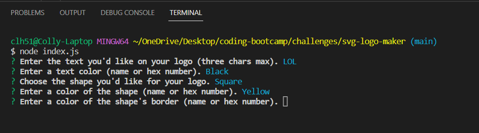
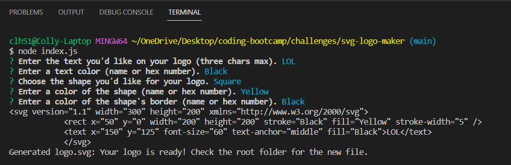

# svg-logo-maker

## Description

This application allows the user to generate a bare bones logo with no graphics software necessary. By answering five prompts in Node, the user can set the basic parameters for a logo that includes shapes, colors, and text. 

It was also an exercise in test driven development, using Jest as a testing program. If you look at the createShape.test.js file, you can see that the functions of this application are tested to ensure they're functional.

## Installation

No installation is required for this application. All you need to run it is to launch index.js in Node.

## Usage

A video tutorial of the application can be found [here] <!-- (INSERT URL HERE) -->

Launch index.js using Node. You will immediately be given a series of five prompts asking for the details of your desired logo (text content, text color, shape, shape color, and border color). Only three characters maximum are allowed for the text content.

After answering all of the prompts, you will receive a success notification letting you know your logo is ready. You can find the generated logo in the root folder (where the index.js folder is located).

With future development, more intricate designs could be made available, and more customization options. Below is an example of a logo generated using this application.

